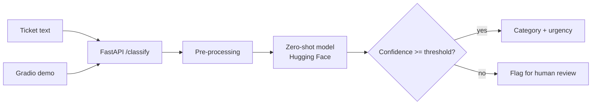

# AI Ticket Triage

> Classify support tickets and incidents by **category** and **urgency** using open-source **Hugging Face** models — no training data required.


## Why this project

Support and operations teams lose time reading every incoming ticket just to decide where it goes and how urgent it is. This service does that first triage automatically, in Spanish, Catalan or English, so humans can focus on solving the problem instead of sorting it.

It uses **zero-shot classification**, so categories can be changed in a config file without retraining any model.

## Features

- **Zero-shot, multilingual classification** with a pre-trained NLI model from Hugging Face
- **Configurable labels**: categories and urgency levels defined in `labels.yaml`
- **Confidence scores** and a "needs human review" flag below a threshold
- **REST API** built with FastAPI (`POST /classify`, `POST /classify/batch`)
- **Interactive demo** with Gradio, deployable to Hugging Face Spaces
- **Evaluation script** that reports accuracy, precision/recall and a confusion matrix against a labelled sample dataset
- **Docker image** and **GitHub Actions CI** (lint, tests, evaluation)

## Architecture



## Example

```bash
curl -X POST http://localhost:8000/classify \
  -H "Content-Type: application/json" \
  -d '{"text": "The invoice PDF is not generated since this morning and clients are calling"}'
```

```json
{
  "category": "billing",
  "urgency": "high",
  "confidence": 0.87,
  "needs_review": false
}
```

> The response above illustrates the expected format; real scores depend on the model and labels.

## Repository structure

```text
.
├── app/
│   ├── api.py              # FastAPI endpoints
│   ├── classifier.py       # Model loading and inference
│   └── config.py           # Settings and thresholds
├── demo/
│   └── gradio_app.py       # Hugging Face Spaces demo
├── eval/
│   ├── dataset.csv         # Small labelled sample (synthetic)
│   └── evaluate.py         # Metrics and confusion matrix
├── tests/
├── labels.yaml
├── Dockerfile
└── .github/workflows/ci.yml
```

## Getting started

```bash
git clone https://github.com/xavieroldan/ai-ticket-triage.git
cd ai-ticket-triage
python -m venv .venv && source .venv/bin/activate
pip install -r requirements.txt
uvicorn app.api:app --reload
```

With Docker:

```bash
docker build -t ai-ticket-triage .
docker run -p 8000:8000 ai-ticket-triage
```

## Tech stack

Python 3.11 · Hugging Face Transformers · FastAPI · Gradio · Docker · GitHub Actions · pytest

## Roadmap

- [ ] Classifier with configurable labels
- [ ] FastAPI endpoints and OpenAPI docs
- [ ] Gradio demo on Hugging Face Spaces
- [ ] Synthetic labelled dataset and evaluation report
- [ ] Docker image and CI pipeline
- [ ] Optional LLM fallback for low-confidence tickets

## What this project demonstrates

- Applying **open-source AI models** to a real business problem
- Building a clean, tested **REST API** around a model
- Measuring model quality instead of assuming it works

## Author

**Xavier Roldán** — Senior Developer & Team Lead
[xavierroldan.com](https://xavierroldan.com) · [LinkedIn](https://www.linkedin.com/in/xavierroldan/)

## License

MIT
