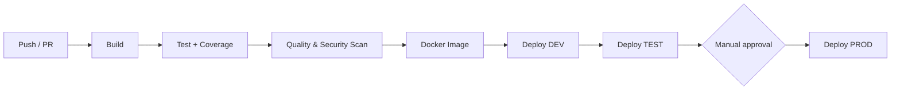

# CI/CD Pipeline Templates

> Reusable, production-grade CI/CD pipelines for **.NET** and **Java** services — implemented in both **GitHub Actions** and **Azure DevOps**.


## Why this project

Most teams copy-paste pipeline YAML between repositories until every project has its own slightly different (and slightly broken) version. This repository provides **one versioned set of templates** that any .NET or Java service can consume with a few lines of configuration, so that build, test, packaging and deployment work the same way everywhere.

It is based on the patterns I apply professionally when automating multi-country enterprise projects, rewritten from scratch with no client code.

## Features

- **Reusable workflows** (`workflow_call`) for GitHub Actions and **YAML templates** for Azure DevOps
- **Build & test** for .NET (`dotnet`) and Java (Maven), with dependency caching
- **Quality gates**: unit tests, code coverage report and linting
- **Docker**: multi-stage image build, tagging by semantic version and commit SHA, push to GitHub Container Registry / Azure Container Registry
- **Environment promotion**: `DEV → TEST → PROD` with manual approval on production
- **Security**: OIDC federation to the cloud provider (no long-lived secrets), least-privilege `permissions`, dependency and image scanning
- **Semantic versioning** and automatic release notes from Conventional Commits

## Architecture



## Repository structure

```text
.
├── .github/workflows/
│   ├── dotnet-ci.yml          # Reusable: build + test .NET
│   ├── java-ci.yml            # Reusable: build + test Java (Maven)
│   ├── docker-build.yml       # Reusable: build, scan and push image
│   └── deploy.yml             # Reusable: deploy to an environment
├── azure-devops/
│   ├── templates/
│   │   ├── dotnet-build.yml
│   │   ├── java-build.yml
│   │   ├── docker.yml
│   │   └── deploy.yml
│   └── azure-pipelines.yml    # Example consumer pipeline
├── samples/
│   ├── dotnet-minimal-api/    # Sample .NET 8 service
│   └── springboot-api/        # Sample Spring Boot service
└── docs/
    └── usage.md
```

## Quick start (GitHub Actions)

```yaml
# .github/workflows/ci.yml in a consumer repository
name: CI
on:
  push:
    branches: [main]
  pull_request:

jobs:
  ci:
    uses: xavieroldan/cicd-pipeline-templates/.github/workflows/dotnet-ci.yml@v1
    with:
      project-path: src/MyService
      dotnet-version: "8.0.x"

  image:
    needs: ci
    uses: xavieroldan/cicd-pipeline-templates/.github/workflows/docker-build.yml@v1
    with:
      image-name: my-service
    permissions:
      contents: read
      packages: write
```

## Quick start (Azure DevOps)

```yaml
# azure-pipelines.yml in a consumer repository
resources:
  repositories:
    - repository: templates
      type: github
      name: xavieroldan/cicd-pipeline-templates
      ref: refs/tags/v1

stages:
  - template: azure-devops/templates/dotnet-build.yml@templates
    parameters:
      projectPath: src/MyService
```

## Tech stack

GitHub Actions · Azure DevOps Pipelines · Docker · .NET 8 · Java 21 / Maven · GitHub Container Registry · OIDC

## Roadmap

- [ ] Reusable .NET build and test workflow
- [ ] Reusable Java (Maven) build and test workflow
- [ ] Docker build, scan and push workflow
- [ ] Environment deployment with approvals
- [ ] Azure DevOps equivalents of all templates
- [ ] Sample apps wired end to end
- [ ] Usage documentation and versioned releases

## What this project demonstrates

- Designing CI/CD as a **shared platform** rather than per-project scripts
- Working fluently in **both GitHub Actions and Azure DevOps**
- Secure-by-default pipelines (OIDC, least privilege, scanning)

## Author

**Xavier Roldán** — Senior Developer & Team Lead
[xavierroldan.com](https://xavierroldan.com) · [LinkedIn](https://www.linkedin.com/in/xavierroldan/)

## License

MIT
