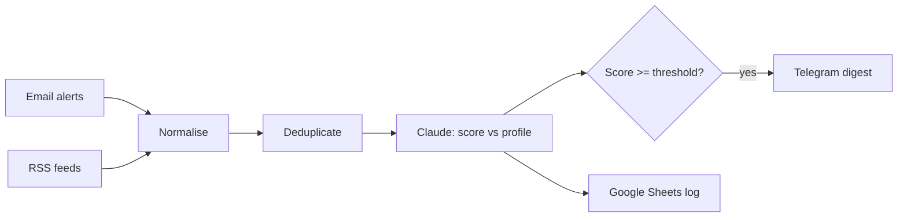

# n8n Job Scout

> An **n8n** workflow that collects job offers, scores them against your profile with **Claude**, and sends you a daily digest of the best matches.


## Why this project

Job alerts arrive from many sources, are full of duplicates and mostly irrelevant. Reading them all every day is tedious. This workflow does the reading for you: it gathers offers, removes noise and uses an LLM to rank them against a written professional profile, so you only review the few that really fit.

## Features

- **Multiple sources**: job-alert emails (IMAP/Gmail) and RSS feeds from job boards
- **Normalisation & deduplication** of offers (title, company, location, remote, link)
- **LLM scoring with Claude**: each offer gets a 0–100 fit score, a short rationale and red flags, based on `profile.md`
- **Versioned prompts** stored in the repo, with structured JSON output
- **Daily digest** via Telegram with the top matches
- **Tracking sheet** in Google Sheets with every offer and its score
- **Self-hosted** with Docker Compose

## Architecture



## Prompt design

The scoring prompt asks the model for a strict JSON response so the workflow can parse it reliably:

```json
{
  "score": 0,
  "match_reasons": ["..."],
  "red_flags": ["..."],
  "seniority_fit": "under | fit | over",
  "remote_ok": true
}
```

Prompts live in `prompts/` and are versioned, so changes in scoring behaviour can be reviewed like code.

## Repository structure

```text
.
├── workflows/
│   └── job-scout.json      # Exported n8n workflow
├── prompts/
│   └── score-offer.md      # Scoring prompt (versioned)
├── profile.example.md      # Template for your professional profile
├── docker-compose.yml      # n8n self-hosted
├── .env.example            # API keys and settings (never commit real values)
└── docs/
    └── setup.md
```

## Getting started

```bash
git clone https://github.com/xavieroldan/n8n-job-scout.git
cd n8n-job-scout
cp .env.example .env              # add your own keys
cp profile.example.md profile.md  # describe your target role
docker compose up -d
```

Then open n8n at `http://localhost:5678`, import `workflows/job-scout.json` and set up the credentials (IMAP, Anthropic API, Telegram, Google Sheets).

## Responsible use

- Uses **alerts and feeds you subscribe to**; it does not scrape sites that forbid it in their terms
- Personal data and API keys stay in your own `.env` and are never committed

## Tech stack

n8n · Claude API (Anthropic) · Prompt engineering · Telegram Bot API · Google Sheets · Docker Compose

## Roadmap

- [ ] Email and RSS ingestion
- [ ] Normalisation and deduplication
- [ ] Claude scoring with structured output
- [ ] Telegram digest and Google Sheets log
- [ ] Docker Compose setup and documentation
- [ ] Weekly summary with trends (roles, locations, salary ranges when available)

## What this project demonstrates

- Designing **AI-powered automations** with n8n
- **Prompt engineering** with structured, testable outputs
- Integrating several APIs into one reliable workflow

## Author

**Xavier Roldán** — Senior Developer & Team Lead
[xavierroldan.com](https://xavierroldan.com) · [LinkedIn](https://www.linkedin.com/in/xavierroldan/)

## License

MIT
